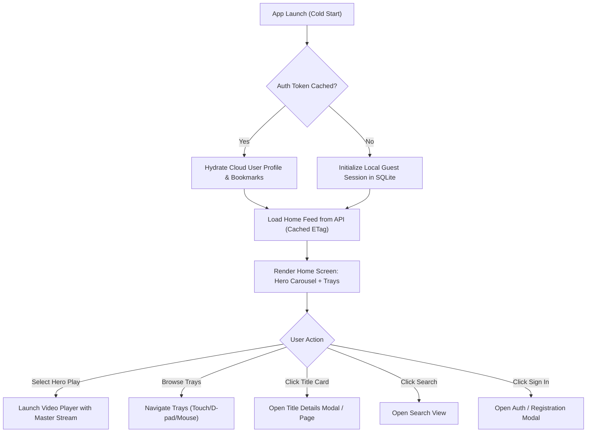
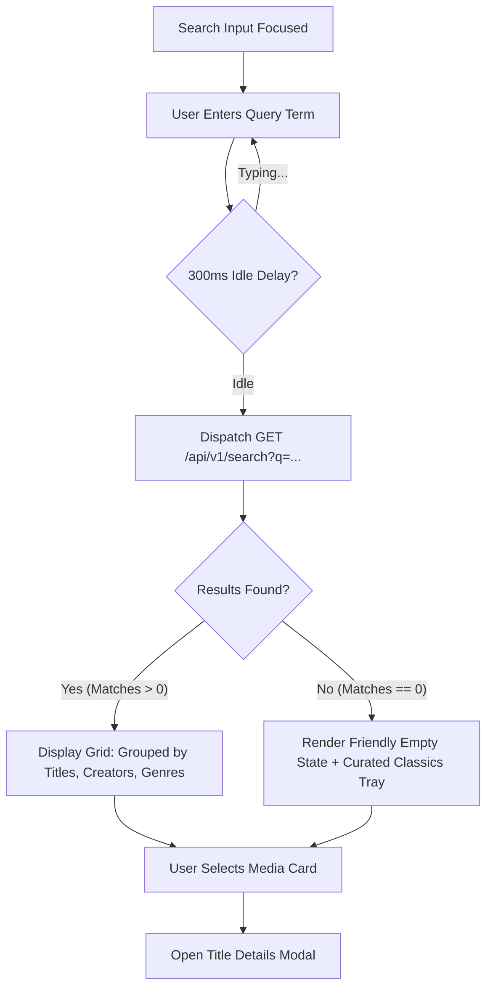
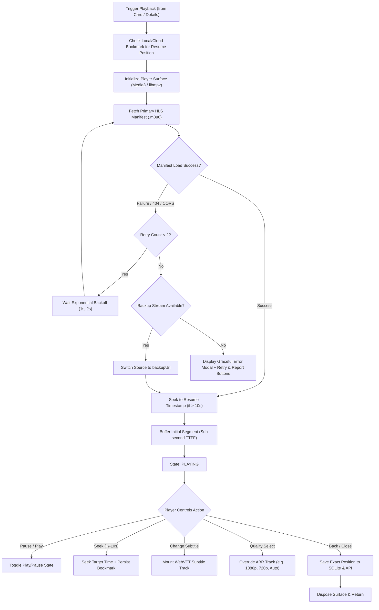
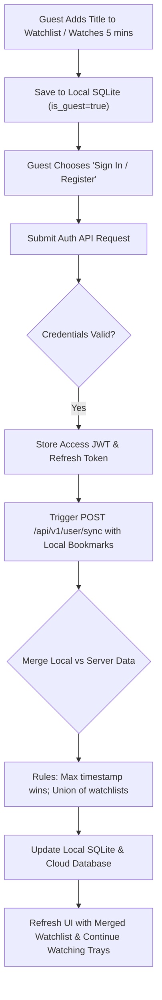
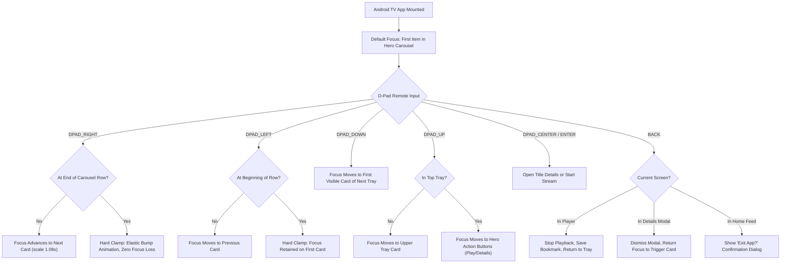

# PHASE 1 — DELIVERABLE 1: USER FLOWS & INTERACTION ARCHITECTURE

**Document Version**: 1.0.0  
**Phase**: Phase 1 (UX & Design System)  
**Primary Owners**: Agent 2 — UI/UX Design Agent & Agent 1 — Product Manager / Requirements Agent  
**Status**: Submitted for Verification  

---

## 1. USER FLOW TAXONOMY & ARCHITECTURAL PRINCIPLES

The user experience is engineered around three foundational tenets:
1. **Instant Gratification (Zero-Friction Guest Mode)**: Users can browse the entire catalog and begin streaming within 2 clicks from cold start without registering or entering personal data.
2. **Deterministic Resumption**: Watch history and bookmarks are saved immediately at the millisecond level and automatically promoted from local guest storage to cloud storage upon user sign-in.
3. **Form-Factor Native Interaction**: 
   - Android Mobile: One-handed thumb reachability, edge gestures.
   - Android Tablet: Responsive multi-column grid with split-pane title inspection.
   - Android TV: 10-foot D-pad navigation, high-visibility focus indicators, zero pointer traps.
   - Desktop: Keyboard shortcuts, hover states, multi-window responsiveness.

---

## 2. CORE USER JOURNEYS & STATE FLOWCHARTS

### FLOW 1: Cold Start, Guest Mode & Discovery

---

### FLOW 2: Search, Query Filtering & Discovery

---

### FLOW 3: Video Player Lifecycle & Error Recovery

---

### FLOW 4: Watchlist & Guest-to-Account Migration

---

### FLOW 5: Android TV D-Pad Remote Traversal

