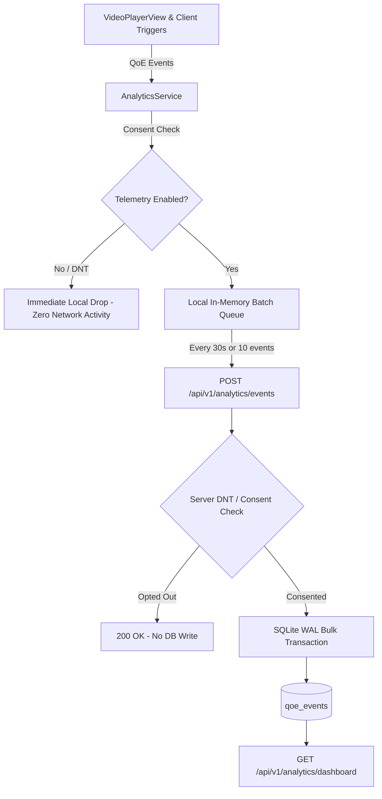

# Quality of Experience (QoE) Telemetry & Privacy Pipeline

**Document ID**: TDR-P6-001  
**Author**: Agent 12 (Analytics & Telemetry Specialist), Agent 6 (Backend Engineer), Agent 9 (Security & Privacy Specialist)  
**Status**: APPROVED  
**Date**: 2026-09-19  

---

## 1. Executive Summary & Privacy Principles

The Cross-Platform Streaming App is a 100% legal, free, open streaming platform. We reject invasive user tracking, behavioral profiling, device fingerprinting, and surveillance advertising.

The purpose of our telemetry pipeline is **exclusively diagnostic**:
1. Measure video streaming quality (Quality of Experience — QoE).
2. Detect content delivery network (CDN) degradation and buffer stalls.
3. Optimize adaptive bitrate (ABR) switching algorithms across edge devices.

### Absolute Privacy Guarantees
- **Zero PII**: No email addresses, usernames, real names, or IP addresses are persisted.
- **Zero Hardware Fingerprinting**: No MAC addresses, IMEI, Android ID, Google Advertising ID (GAID), or Apple IDFA.
- **Ephemeral Session Identifiers**: Sessions are pseudo-random hex identifiers (`sess_${timestamp}_${random}`) generated locally per playback instance and discarded upon app close.
- **Strict User Consent Controls**: Telemetry honors the browser/OS `DNT: 1` (Do Not Track) and `Sec-GPC: 1` (Global Privacy Control) headers, as well as the in-app `Anonymous Diagnostic Telemetry` toggle in Settings.

---

## 2. Telemetry Ingestion Architecture



---

## 3. Data Schema & Metrics

### QoE Event Object Specification
| Field | Type | Description | Privacy Constraints |
| :--- | :--- | :--- | :--- |
| `id` | `TEXT (PK)` | Server-generated event ID (`qoe_${random}`) | Random UUID/hex only |
| `session_id` | `TEXT` | Ephemeral playback session identifier | Rotates every media load |
| `media_id` | `TEXT` | Content identifier (e.g. `media-001`) | Public catalog reference |
| `platform` | `TEXT` | Target client platform (`android-phone`, `android-tablet`, `android-tv`, `windows`, `linux`) | High-level bucket only |
| `event_type` | `TEXT` | Event classification (`start`, `buffer_stall`, `bitrate_shift`, `error`, `complete`) | Strictly enumerated |
| `startup_time_ms` | `REAL` | Time to First Frame (TTFF) in milliseconds | Playback diagnostic only |
| `buffer_duration_ms` | `REAL` | Duration of rebuffer stall in milliseconds | Playback diagnostic only |
| `target_bitrate_bps` | `INTEGER`| Video bitrate selected by ABR in bits/second | Codec/network diagnostic |
| `error_code` | `TEXT` | Video player failure code (e.g. `ERR_DECODER_INIT_FAILED`) | Diagnostic error string |
| `timestamp` | `TEXT` | UTC ISO-8601 timestamp (`2026-09-19T...`) | Server reception time |

---

## 4. Consent Lifecycle & Regulatory Compliance

### Compliance Matrix
- **GDPR (Regulation (EU) 2016/679)**: Article 6(1)(f) legitimate interest for technical delivery debugging, supplemented by explicit Article 7 consent toggle. Zero transfer of personal data outside local instance.
- **ePrivacy Directive**: No cookies or persistent trackers stored on user terminals.
- **CCPA/CPRA**: No "sale" or "sharing" of personal data. Diagnostic data is non-identifiable.

### Client Drop Logic
```dart
void recordEvent(Map<String, dynamic> event) {
  if (!isTelemetryEnabled) {
    // Immediate privacy drop: zero queuing, zero memory retention, zero HTTP transmission
    return;
  }
  _queue.add(event);
}
```

### Server Fallback Gate
```typescript
const isOptedOut = req.headers['dnt'] === '1' 
  || req.headers['sec-gpc'] === '1' 
  || req.headers['x-consent-telemetry'] === 'false' 
  || Boolean(body.optOut);

if (isOptedOut) {
  return this.sendJson(res, 200, { success: true, data: { ingested: 0, optedOut: true } });
}
```
