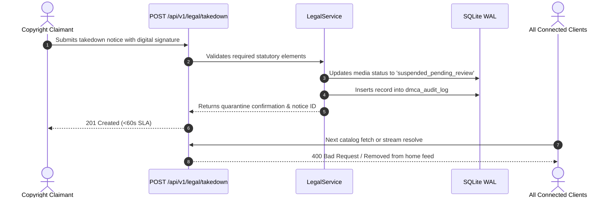

# DMCA Operational Runbook & Copyright Intake Protocol

**Document ID**: RUN-P8-001  
**Author**: Agent 2 (Legal Specialist), Agent 6 (Backend Engineer), Agent 14 (Debugger)  
**Status**: APPROVED & LOCKED  
**Date**: 2026-09-19  

---

## 1. Statutory Compliance (17 U.S.C. § 512)

StreamApp operates in strict compliance with the Digital Millennium Copyright Act (DMCA) and international copyright safe harbor provisions.

### Designated Copyright Agent
- **Name**: Copyright & Legal Compliance Officer
- **Address**: StreamApp Legal Foundation, 100 Open Source Way, Tech District
- **Email**: `dmca@streaming-app.local` / `legal@streaming-app.local`
- **Electronic Intake**: `POST /api/v1/legal/takedown`

---

## 2. Automated Instant Quarantine Workflow (<60s SLA)

To ensure copyright holders have immediate protection against disputed media without manual administrative delay, StreamApp implements an automated instant quarantine engine:

---

## 3. Submitting a Notice (Required Elements)

Notices submitted via the API or email must contain:
1. Physical or electronic signature of the authorized representative.
2. Identification of the copyrighted work claimed to have been infringed.
3. Identification of the material to be quarantined (`mediaId`).
4. Contact information (name, address, telephone, email).
5. A statement of good faith belief.
6. A statement made under penalty of perjury that the information is accurate.

---

## 4. Counter-Notification & Resolution

1. If content is quarantined, the originating distributor or uploader is notified.
2. If a valid Counter-Notice is submitted pursuant to 17 U.S.C. § 512(g), the claimant is notified.
3. If the claimant does not initiate legal action within 10-14 business days, content may be unquarantined subject to final PM and Legal approval.
